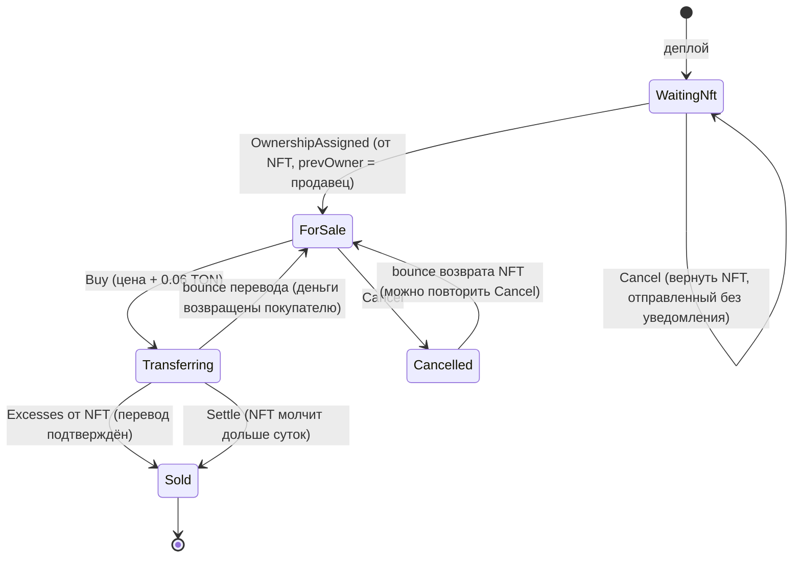

# GiftSwap

Эскроу-контракт для безопасной продажи **одного NFT за TON** в блокчейне TON. Написан на **Tolk 1.4.2**, собирается и тестируется через **Blueprint 0.46.0** и **Sandbox**.

> **Статус: экспериментальный проект.** Контракт не проходил независимый аудит. Запускать его можно только в Sandbox и в testnet, ценные NFT на mainnet с ним выставлять нельзя. Известные проблемы перечислены в разделе [«Известные ограничения»](#известные-ограничения).

## Содержание

1. [Что это и зачем](#что-это-и-зачем)
2. [Как это работает](#как-это-работает)
3. [Сообщения, ошибки, get-метод](#сообщения-ошибки-get-метод)
4. [От каких атак защищает контракт](#от-каких-атак-защищает-контракт)
5. [Структура проекта: что делает каждый файл](#структура-проекта-что-делает-каждый-файл)
6. [Замеры газа и константы](#замеры-газа-и-константы)
7. [Как запустить](#как-запустить)
8. [Проверка на настоящем testnet](#проверка-на-настоящем-testnet)
9. [Аналоги в других экосистемах](#аналоги-в-других-экосистемах)
10. [Известные ограничения](#известные-ограничения)
11. [Что дальше](#что-дальше)
12. [Как проверялось качество](#как-проверялось-качество)
13. [Лицензия](#лицензия)

---

## Что это и зачем

Продавец хочет продать NFT, покупатель хочет заплатить за него TON. Они друг другу не доверяют. Если продавец отправит NFT первым, покупатель может не заплатить. Если покупатель заплатит первым, продавец может не отдать NFT.

GiftSwap решает это классическим способом, который в финансах называют *«поставка против платежа»* (DvP, delivery versus payment), а в программировании *эскроу* (escrow):

1. NFT сначала кладётся **в контракт**.
2. Покупатель платит **контракту**, а не продавцу.
3. Контракт передаёт NFT покупателю и **только после подтверждения** перевода платит продавцу.
4. Если перевод NFT не удался, деньги возвращаются покупателю.

Ни одна из сторон не может забрать чужое: у контракта нет владельца-администратора, а продавец видит деньги только после того, как NFT ушёл.

---

## Как это работает

### Сценарий

| Шаг | Кто | Что делает | Состояние контракта |
|---|---|---|---|
| 1 | Продавец | Деплоит контракт с адресом NFT и ценой (`scripts/deployGiftSwap.ts`) | `WaitingNft` |
| 2 | Продавец | Переводит NFT на адрес контракта с `forward_amount` не меньше 0.01 TON. NFT присылает контракту уведомление `OwnershipAssigned` | `ForSale` |
| 3 | Покупатель | Шлёт `Buy` с суммой не меньше `цена + 0.06 TON`. Контракт **держит деньги** и просит NFT перевестись покупателю | `Transferring` |
| 4a | NFT | Подтверждает перевод сообщением `Excesses`. Контракт платит продавцу цену и возвращает покупателю излишек | `Sold` |
| 4b | NFT | Отказался переводиться (bounce). Контракт возвращает деньги покупателю, продажа снова открыта | `ForSale` |
| 4c | Любой | NFT молчит (нет ни `Excesses`, ни bounce) дольше суток после покупки: сообщение `Settle` завершает сделку как успешную | `Sold` |
| — | Продавец | Может передумать: `Cancel` возвращает NFT продавцу | `Cancelled` |
| — | Продавец | Может забрать остатки TON: `Withdraw` | без изменений |

### Диаграмма состояний



`Withdraw` (забрать остаток TON) разрешён только в `WaitingNft`, `Sold` и `Cancelled`, то есть там, где в контракте нет чужих денег. В `Transferring` там лежат деньги покупателя, в `ForSale` идёт продажа.

### Почему состояний больше, чем кажется

В TON контракты общаются **асинхронными сообщениями**: отправив NFT-контракту просьбу о переводе, мы не узнаём результат в той же транзакции. В Ethereum или Solana неудачный перевод откатил бы всю транзакцию вместе с платежом. В TON откатить нечем, поэтому эту логику пришлось построить вручную: промежуточное состояние `Transferring`, подтверждение `Excesses`, обработчик bounce и запасной выход `Settle`.

---

## Сообщения, ошибки, get-метод

### Входящие сообщения

| Сообщение | Код операции | Кто может отправить | В каком состоянии | Что делает |
|---|---|---|---|---|
| `OwnershipAssigned` | `0x05138d91` (TEP-62) | депозит: только адрес NFT | депозит: `WaitingNft` | Депозит принят, если отправитель — наш NFT, а предыдущий владелец — продавец. Ставит `ForSale`. Любой другой NFT (чужой, наш не от продавца, наш после сделки) контракт возвращает `prevOwner`, если с уведомлением пришло не меньше 0.01 TON (`NFT_RETURN_MIN`); иначе отвергает |
| `Excesses` | `0xd53276db` (TEP-62) | только адрес NFT, и только с `query_id` текущего перевода | `Transferring` | Подтверждение перевода: платит продавцу, возвращает излишек покупателю, ставит `Sold` |
| `Buy` | `0x0b5a0001` | любой | `ForSale` | Принимает деньги, ставит `Transferring`, просит NFT перевестись покупателю |
| `Cancel` | `0x0b5a0002` | только продавец | `ForSale` или `WaitingNft` | Возвращает NFT продавцу (в `ForSale` ставит `Cancelled`) |
| `Withdraw` | `0x0b5a0003` | только продавец | `WaitingNft`, `Sold`, `Cancelled` | Отправляет продавцу остаток TON, оставляя 0.02 TON на хранение. Если сверх резерва меньше 0.005 TON, отклоняется (107) |
| `Settle` | `0x0b5a0004` | любой, но не раньше чем через 24 часа (86400 с) после `Buy` | `Transferring` | Завершает сделку как успешную, если NFT так и не ответил |
| пустое сообщение | нет | любой | любое | Простое пополнение баланса |
| bounce (возврат) | служебный | только адрес NFT, и только с `query_id` текущего перевода | `Transferring`, `Cancelled` | Откат неудачного перевода NFT |

Любое другое сообщение отвергается ошибкой `0xFFFF`.

**Про `query_id`.** Сообщения `Buy`, `Cancel`, `Withdraw` и `Settle` состоят только из кода операции. Каждый перевод NFT (при `Buy` и при `Cancel`) контракт отправляет со **своим** `query_id`: это логическое время транзакции, оно уникально и заранее никому не известно. Ответ NFT (`Excesses` или bounce) принимается только с этим `query_id`. Так старое, чужое или подделанное сообщение не может сойти за ответ на текущую покупку.

### Исходящее сообщение

`NftTransfer` (`0x5fcc3d14`, TEP-62): просьба к NFT-контракту передать себя новому владельцу. Контракт шлёт его при `Buy` (покупателю, с bounce) и при `Cancel` (продавцу, с bounce), каждый раз с новым `query_id`.

### Коды ошибок

| Код | Название | Когда |
|---|---|---|
| 101 | `ERR_NOT_EXPECTED_NFT` | `Excesses` пришло не от адреса нашего NFT, либо уведомление о чужом NFT пришло с суммой меньше `NFT_RETURN_MIN` (вернуть не на что) |
| 102 | `ERR_NOT_SELLER` | `Cancel`/`Withdraw` шлёт не продавец, либо наш NFT внёс не продавец и суммы на возврат не хватает |
| 103 | `ERR_WRONG_STATE` | действие не подходит текущему состоянию |
| 104 | `ERR_WRONG_AMOUNT` | приложено меньше минимума |
| 105 | `ERR_WRONG_QUERY_ID` | `Excesses` не относится к текущему переводу NFT |
| 106 | `ERR_TOO_EARLY` | `Settle` раньше срока |
| 107 | `ERR_NOTHING_TO_WITHDRAW` | `Withdraw`, когда сверх резерва (`WITHDRAW_KEEP`) лежит меньше `WITHDRAW_MIN` (0.005 TON) |
| 0xFFFF | `ERR_UNKNOWN_OP` | непонятное сообщение |

У тестового NFT (`MockNftItem`) свои коды: 401 (не владелец), 402 (мало TON), 403 (тестовый отказ от переводов).

### Get-метод

`swapInfo()` возвращает: `state`, `seller`, `nftAddress`, `price`, `buyer` (или `null`), `paid`, `queryId` (query_id перевода, ответ на который ждём, 0 если такого нет), `settleAfter` (с какого unixtime работает `Settle`, 0 если покупки нет). Читает его обёртка `GiftSwap.getSwapInfo()`.

---

## От каких атак защищает контракт

| Атака | Как отбивается | Где в коде | Где проверено |
|---|---|---|---|
| **Поддельное уведомление**: злоумышленник шлёт сообщение с кодом `OwnershipAssigned` и делает вид, что NFT внесён | Депозитом считается только уведомление от адреса `nftAddress`; `sender` берётся из самого сообщения сети, а не из его тела. Просьба о возврате уходит отправителю уведомления, а не на `nftAddress`, поэтому подделка «переводит» только кошелёк самого злоумышленника и не может увести NFT сделки | `handleOwnershipAssigned` | `attack: a fake notification from a random wallet changes nothing…`, `attack: a fake notification while the NFT is for sale cannot make the contract move that NFT` |
| **Чужой NFT**: пришёл другой NFT либо тот же NFT, но не от продавца (или уже после продажи) | Депозитом не считается. NFT возвращается `prevOwner` за счёт TON уведомления (режим отправки 64), баланс контракта не тратится. Если TON меньше `NFT_RETURN_MIN`, уведомление отвергается (101/102/103) | `handleOwnershipAssigned`, `returnNft` | `a different NFT sent by mistake returns to its owner…`, `the right NFT deposited by someone other than the seller goes back…`, `after the sale, the buyer sending the NFT back…`, `attack: a spam of fake notifications does not lower the contract balance` |
| **Неверная сумма** | Проверка `value >= price + NFT_TRANSFER_MIN + GAS_RESERVE` до любых изменений | `handleBuy` | `rejects a payment that is less than the price`, `rejects exactly the price without fees…` |
| **Повторная покупка** | Купить можно только в `ForSale`. Как только пошла покупка, состояние `Transferring`, дальше `Sold`: вторая попытка получает 103 | `handleBuy` | `rejects a repeated purchase…` |
| **Поддельное подтверждение**: кто-то шлёт `Excesses`, чтобы заставить контракт заплатить продавцу | Принимается только от `nftAddress` и только в `Transferring`, повторное отвергается | `handleExcesses` | `attack: fake excesses…`, `attack: repeated excesses…` |
| **Потеря денег при сбое перевода NFT** | Деньги удерживаются, продавцу платим только после `Excesses`. При bounce деньги возвращаются | `handleBuy`, `handleExcesses`, `onBouncedMessage` | `failed NFT transfer: bounce returns the money…` |
| **Ответ не на ту покупку**: старый или чужой `Excesses`, опоздавший bounce от другого перевода (например, от `Cancel`, отправленного в `WaitingNft`) | Оба ответа принимаются только с `query_id`, который контракт выбрал для текущего перевода; в bounce дополнительно сверяется код операции и отправитель | `handleExcesses`, `onBouncedMessage` | `attack: an excesses with a foreign query_id…`, `attack: a bounce with a foreign query_id…`, `race: a stale bounce of a Cancel…` |
| **NFT не отвечает вовсе**: деньги и сделка зависли бы навсегда | `Settle` через сутки после покупки завершает сделку (тишина после отправки с bounce означает успех); опоздавшие ответы после этого отвергаются или игнорируются | `handleSettle` | `settle works exactly at the deadline…`, `settle is still rejected 23 hours after the buy…`, `a late excesses or bounce after settle…` |
| **Продавец забирает деньги покупателя через `Withdraw`** | `Withdraw` запрещён в `Transferring` и `ForSale` | `handleWithdraw` | `withdraw is rejected while a purchase is in progress…` |
| **Чужой `Cancel` или `Withdraw`** | Только `sender == seller` | `handleCancel`, `handleWithdraw` | `rejects cancel from someone other than the seller`, `attack: withdraw by a stranger…` |
| **Повторная отправка NFT после депозита** или попытка выманить NFT сделки уведомлением | Депозит принимается только в `WaitingNft`; в `ForSale` и `Transferring` уведомление от нашего NFT отвергается (103), и NFT сделки никуда не отправляется | `handleOwnershipAssigned` | `rejects a second deposit notification and never gives away the NFT of the deal…` |
| **Истощение контракта** повторными неудачными покупками | Из возврата вычитается `GAS_RESERVE`, каждая попытка приносит контракту плюс | `onBouncedMessage` | `reserve: a failed buy does not drain the contract…` |
| **Спам посторонних** (gas griefing): поток `Withdraw`, `Cancel`, `Settle`, `Buy` и мусора, чтобы проесть баланс контракта | Отвергнутое сообщение оплачивает свой газ из собственных TON, а остаток возвращается отправителю bounce. Баланс контракта не тратится | все обработчики | `attack: spam from a stranger… never lowers the contract balance` |
| **Пустой `Withdraw`**: продавец тратит комиссию, когда выводить нечего | Отказ 107, если сверх резерва меньше 0.005 TON; приложенные TON возвращаются bounce | `handleWithdraw` | `withdraw with nothing left over is rejected (107)…` |

Общий принцип везде один: **сначала проверки, потом изменение состояния, и только потом отправка денег или сообщений**.

---

## Структура проекта: что делает каждый файл

Проект создан командой `npm create ton@latest -- GiftSwap --contractName GiftSwap --type tolk-empty`, поэтому папки и часть файлов (`wrappers/`, `tests/`, `scripts/`, конфиги) созданы по соглашениям Blueprint: он ищет всё именно там.

### Исходный код контракта: `contracts/`

**`contracts/gift_swap.tolk`**: сам контракт.
- *Что делает:* хранит состояние сделки (`WaitingNft` → … → `Sold`/`Cancelled`), принимает сообщения `OwnershipAssigned`, `Excesses`, `Buy`, `Cancel`, `Withdraw`, `Settle`, обрабатывает bounce, возвращает отправителю ненужные NFT, отдаёт данные через `swapInfo()`.
- *Зачем нужен:* это и есть продукт. Всё остальное в репозитории существует, чтобы собрать, проверить и запустить этот файл.
- *Почему здесь:* Blueprint по соглашению берёт исходники контрактов из `contracts/`; конкретный путь указан в `wrappers/GiftSwap.compile.ts`.

**`contracts/mock_nft_item.tolk`**: тестовый NFT (только для тестов, на mainnet не деплоить).
- *Что делает:* упрощённая модель NFT по стандарту TEP-62. Хранит владельца, принимает `transfer` только от владельца, шлёт `ownership_assigned` (если `forward_amount > 0`) и `excesses`. Правило достаточности TON скопировано из референсной реализации `nft-item.fc`: `баланс − 0.05 − комиссии ≥ 0`. Также есть тестовый переключатель «отказывать в переводах», которого в настоящем NFT нет.
- *Зачем нужен:* чтобы проверять GiftSwap против **настоящих цепочек сообщений** (депозит, перевод, подтверждение, bounce), а не против кошелька-заглушки, и чтобы замерять газ.
- *Почему здесь:* Blueprint компилирует любой файл из `contracts/`, у которого есть `*.compile.ts` в `wrappers/`, поэтому тестовый контракт живёт рядом с основным.

### Обёртки: `wrappers/`

Обёртка это TypeScript-класс, который скрывает внутренности контракта (как собрать сообщение, как разобрать ответ) за понятными методами. Тесты и скрипты общаются с контрактом только через них.

**`wrappers/GiftSwap.ts`**: обёртка основного контракта.
- *Что делает:* собирает начальные данные (`giftSwapConfigToCell`), отправляет `sendDeploy`, `sendBuy`, `sendCancel`, `sendWithdraw`, `sendSettle`, читает `getSwapInfo`. Экспортирует `SwapState` (номера состояний), `Opcodes`, `Errors` и `Constants` (числа, общие с контрактом), а также помощники для тестов (`ownershipAssignedBody`, `excessesBody`).
- *Зачем нужен:* без него каждый тест пришлось бы собирать биты сообщений вручную; общие константы не дают тестам разойтись с контрактом.
- *Почему здесь:* так устроен Blueprint: одна обёртка на контракт в `wrappers/`, имя совпадает с именем контракта.

**`wrappers/GiftSwap.compile.ts`**: конфиг компиляции основного контракта.
- *Что делает:* сообщает Blueprint, что контракт на Tolk и где лежит точка входа (`contracts/gift_swap.tolk`).
- *Зачем нужен:* по нему работают `npx blueprint build GiftSwap` и функция `compile('GiftSwap')` в тестах.
- *Почему здесь:* Blueprint ищет файлы вида `wrappers/<Имя>.compile.ts`.

**`wrappers/MockNftItem.ts`**: обёртка тестового NFT.
- *Что делает:* деплой NFT, `sendTransfer` (собирает `transfer` по схеме TEP-62), `sendSetReject` (тестовый отказ), `getOwner`. Экспортирует коды ошибок NFT.
- *Зачем нужен:* чтобы тесты могли «быть продавцом», который переводит NFT на контракт.
- *Почему здесь:* то же соглашение Blueprint, что и выше.

**`wrappers/MockNftItem.compile.ts`**: конфиг компиляции тестового NFT (точка входа `contracts/mock_nft_item.tolk`).

### Тесты: `tests/`

**`tests/GiftSwap.spec.ts`**: 42 теста логики самого контракта.
- *Что делает:* «NFT» здесь обычный кошелёк. Тест сам шлёт от его имени нужные сообщения (`OwnershipAssigned`, `Excesses`, а также имитацию bounce), поэтому можно точно управлять порядком, отправителем и временем. Проверяет состояния, все сообщения об ошибках, атаки, привязку ответов к покупке по `query_id`, `Settle` (в том числе границу срока по секундам), возвраты денег и граничные суммы.
- *Зачем нужен:* быстро и точно проверять каждую ветку логики, в том числе те, которые настоящий NFT не воспроизведёт (например, поддельное подтверждение).
- *Почему здесь:* Jest подхватывает `*.spec.ts` из `tests/`.

**`tests/GiftSwapWithNft.spec.ts`**: 41 интеграционный тест с тестовым NFT.
- *Что делает:* проверяет весь путь с настоящими цепочками сообщений: депозит, покупка, подтверждение, провал перевода и bounce, `Cancel`, `Withdraw`, возврат чужого NFT и NFT, внесённого не продавцом. В разделе про газ закрепляет замеры: бюджет газа обработчиков, что контракт не истощается, запас `NFT_TRANSFER_MIN`, минимальный `forward_amount`, плата за хранение.
- *Зачем нужен:* показывает, что контракт работает вместе с NFT, а не только сам по себе, и ловит расхождения констант с замерами.
- *Почему здесь:* то же, что и выше.

### Скрипты: `scripts/`

**`scripts/deployGiftSwap.ts`**: скрипт деплоя.
- *Что делает:* спрашивает адрес NFT и цену, берёт продавцом того, кто запустил скрипт, деплоит контракт, ждёт подтверждения и напоминает про `forward_amount` при переводе NFT.
- *Зачем нужен:* запуск в testnet: `npx blueprint run`.
- *Почему здесь:* Blueprint выводит в меню `npx blueprint run` все файлы из `scripts/`.

### Служебные файлы в корне

**`README.md`**: этот файл.

**`LICENSE`**: лицензия MIT.

**`package.json`** / **`package-lock.json`**: список зависимостей и скрипты (`npm test`, `npm run build`, `npm start`, ). Lock-файл фиксирует точные версии, чтобы у всех получались одинаковые результаты. В зависимостях есть компиляторы Tact и FunC: это остаток шаблона Blueprint, мы их не используем.

**`tsconfig.json`**: настройки TypeScript для обёрток, тестов и скриптов (включён строгий режим `strict`).

**`jest.config.ts`**: настройки Jest: запуск через `ts-jest`, окружение Sandbox (`@ton/sandbox/jest-environment`), отчёт по газу от Sandbox.

**`jest.setup.ts`**: скрипт, который Jest выполняет перед тестами. Он вызывает `buildAllTact`. Это **остаток шаблона**: мы Tact не используем, вызов безвреден, но по сути лишний.

**`.gitignore`**: что не попадает в git: `node_modules`, `build`, `temp`, `dist`, файл **`.env`** (сюда, и только сюда, кладутся секреты, если они понадобятся), папки редакторов.

**`.prettierrc`** / **`.prettierignore`**: единый стиль форматирования (ширина 120, отступ 4, одинарные кавычки) и исключение папки `build`.

### Генерируемое (в git не хранится)

- **`build/`**: результат компиляции (`GiftSwap.compiled.json` с байт-кодом контракта).
- **`node_modules/`**: установленные зависимости.

---

## Замеры газа и константы

Замеры сделаны в Sandbox на `MockNftItem` с правилом референсного NFT (см. раздел про газ в `tests/GiftSwapWithNft.spec.ts`). **Это оценки, а не измерения на mainnet.**

| Что | Замер | Константа в контракте |
|---|---|---|
| Комиссия одного обработчика GiftSwap | не больше 0.0004 TON | `GAS_RESERVE = 0.01 TON` (запас более чем в 10 раз) |
| Вся цепочка продажи для контракта | около 0.0008 TON | то же |
| Минимум, который нужен NFT для перевода | около 0.0003 TON | `NFT_TRANSFER_MIN = 0.05 TON` (с большим запасом на NFT с малым балансом; неиспользованное возвращается покупателю) |
| Минимальный `forward_amount` при депозите | около 0.00013 TON | рекомендуем 0.01 TON |
| Плата за хранение за 10 лет | около 0.014 TON (растёт с размером кода: перемерять после заметных правок) | `WITHDRAW_KEEP = 0.02 TON` (хватает лет на 14) |
| Возврат ненужного NFT | NFT с обычным балансом возвращается уже с ~0.00073 TON в уведомлении | `NFT_RETURN_MIN = 0.01 TON` (запас больше 10 раз) |
| Минимальный вывод | вывод меньшей суммы стоит продавцу больше, чем он получит | `WITHDRAW_MIN = 0.005 TON` |
| Срок до `Settle` | это выбор, а не замер: bounce обычно приходит за секунды, но при перегрузке сети сообщения могут задерживаться на часы | `SETTLE_TIMEOUT = 86400 с` (сутки) |

Покупатель платит `цену + 0.06 TON` авансом, но излишек возвращается: в итоге он оплачивает реальные расходы NFT плюс `GAS_RESERVE` (около 0.01 TON).

---

## Как запустить

```bash
npm install                       # установить зависимости
npx blueprint build GiftSwap      # скомпилировать контракт
npx blueprint test                # 83 теста в Sandbox
npx blueprint run                 # выбрать deployGiftSwap и сеть (testnet!)
```

Подключение к кошельку в `npx blueprint run` идёт через TON Connect: ключи остаются в кошельке. Мнемонику в `.env` класть не нужно.

### Как выставить NFT на продажу

1. Задеплойте контракт (`deployGiftSwap`), запомните его адрес.
2. Переведите NFT на адрес контракта **с `forward_amount` не меньше 0.01 TON**. Без него NFT не пришлёт уведомление, контракт не узнает о депозите и останется в `WaitingNft`. NFT при этом не потерян: продавец может вернуть его сообщением `Cancel`.
3. Проверьте `swapInfo()`: состояние должно быть `ForSale`.

### Как купить

Сначала проверьте сделку (см. следующий раздел). Затем отправьте сообщение `Buy` (`0x0b5a0001`, только код операции) с суммой не меньше `цена + 0.06 TON`. Излишек вернётся. Сообщение можно собрать обёрткой (`GiftSwap.sendBuy`, `buyBody()`) в скрипте Blueprint или отправить из кошелька, который умеет отправлять произвольное тело сообщения.

### Как покупателю проверить сделку перед покупкой

Контракт гарантирует обмен «NFT по адресу `nftAddress` против цены», но не может проверить, что этот NFT ценный: в TON контракт не может синхронно вызвать get-метод другого контракта (например, `get_nft_data` у NFT), а картинку и название NFT может скопировать кто угодно. Маркетплейсы, например Getgems, решают это так же, вне блокчейна. Поэтому перед `Buy`:

1. **Код сделки.** Хеш кода по адресу контракта совпадает с хешем скомпилированного `gift_swap.tolk` (`npx blueprint build GiftSwap`). Иначе это может быть другой контракт под тем же названием.
2. **Условия.** `swapInfo()`: состояние `ForSale`, цена та, о которой договорились.
3. **Подлинность NFT.** Откройте `nftAddress` в обозревателе (Tonviewer, Tonscan). Адрес его коллекции должен совпасть с официальным адресом коллекции, а не просто название и картинка.
4. **NFT действительно в сделке.** Текущий владелец этого NFT — адрес контракта сделки.

---

## Проверка на настоящем testnet

21 сентября 2026 контракт прошёл полный сценарий в настоящей сети testnet: два кошелька (продавец и покупатель, Keeper) и **настоящий NFT из Getgems** (не тестовый `MockNftItem`). Транзакции подписывались в кошельке; все суммы и состояния ниже прочитаны из сети, а не с экрана.

> Проверялась предыдущая версия контракта (её хеш кода указан ниже). После проверки изменены только `SETTLE_TIMEOUT` (1 час → 24 часа), `Withdraw` (отказ 107 при пустом остатке) и обработка ненужных NFT (теперь они возвращаются отправителю). Депозит, покупка и выплаты не менялись.

### Что подтвердилось

| Проверка | Результат |
|---|---|
| **Код в сети соответствует исходнику** | Хеш кода на адресе контракта совпал с хешем скомпилированного `gift_swap.tolk` (`4af4e5a272c5ef0e…`) |
| **Деплой** | Контракт активен, состояние `WaitingNft`, продавец, NFT и цена в хранилище верные. Комиссия кошелька 0.002 TON |
| **Депозит настоящего NFT** | Кошелёк отправил NFT `transfer` (0.1 TON, `forward_amount` 0.01). NFT прислал контракту `ownership_assigned` (0.01 TON) и вернул продавцу `excesses` (0.04963 TON): всё по стандарту TEP-62. Комиссия обработки уведомления контрактом 0.00014 TON. Состояние `ForSale` |
| **NFT с малым балансом** | На NFT было всего 0.0098 TON при референсном минимуме 0.05: депозит и покупка всё равно прошли (запас `NFT_TRANSFER_MIN` сработал). После депозита баланс NFT стал 0.0494 |
| **Покупка** | Покупатель → контракт: `Buy` 0.27 TON. Контракт → NFT: `transfer` 0.05 TON. NFT → контракт: `excesses` 0.04934 TON. Контракт → **продавцу 0.20000 TON** и → **покупателю 0.05934 TON**. NFT у покупателя, состояние `Sold` |
| **Формула возврата** | 0.27 − 0.2 − 0.05 − 0.01 + 0.04934 = 0.05934: совпала до знака. Накладные покупателя около 0.011 TON (комиссия кошелька 0.001 и запас контракта 0.01) |
| **Порядок выплат** | Продавцу заплатили только **после** подтверждения перевода от NFT |
| **Комиссии контракта** | `Buy` 0.00046 TON, `excesses` 0.00051 TON: около 0.001 за всю продажу (замер в Sandbox давал 0.0008) |
| **`Withdraw`** | Продавец получил остаток 0.0785 TON (из них 0.03 его же приложенные), на контракте осталось 0.02 TON (`WITHDRAW_KEEP`) |
| **Защита от чужих сообщений** | Три рекламных сообщения от посторонних (с текстом вроде «Get 300 testnet TON» и ссылками на боты, так спамеры «пылят» новые адреса) контракт отверг с кодом `0xFFFF` (`ERR_UNKNOWN_OP`), и деньги вернулись отправителям |

### Что показала проверка (наблюдения о контракте)

- **Повторный `Withdraw` при пустом остатке бесполезен.** Контракт его принимает: продавец нажал его ещё дважды и получил обратно только приложенные 0.03 TON за вычетом комиссии. Вреда нет, только комиссия. В текущей версии такой `Withdraw` отклоняется с ошибкой 107, а приложенные TON возвращаются.
- **`Cancel` в `WaitingNft`, когда NFT ещё не внесён в контракт.** NFT отклонил перевод (контракт ему не владелец), приложенные TON остались на контракте как остаток. Они не потеряны: их можно вернуть `Withdraw` (см. ограничение 8).

### Что не проверялось на настоящем NFT

`Cancel` из состояния `ForSale`, `Settle` и работа с кошельками, кроме Keeper. Они проверены только в Sandbox.

---
## Аналоги в других экосистемах

GiftSwap не изобретает новый механизм. Это стандартная связка из известных паттернов: **эскроу**, **автомат состояний**, **уведомление о получении токена с проверкой отправителя** и **«сначала состояние, потом деньги»**. Ниже сопоставление с проверенными источниками.

### Сводная таблица

Прочерк «—» означает, что соответствие я не проверял по первоисточнику и утверждать его не берусь.

| Идея | GiftSwap (TON) | Ethereum (EVM) | CosmWasm (Cosmos) | Solana | Getgems (TON) |
|---|---|---|---|---|---|
| **NFT приходит в контракт вместе с уведомлением** | `transfer` → `ownership_assigned` (TEP-62) | `safeTransferFrom` → `onERC721Received` (ERC-721) | `SendNft` → `ReceiveNft` (cw721) | обмен атомарной транзакцией из нескольких инструкций, отдельного уведомления нет | то же, что у нас: `ownership_assigned` |
| **Кто прислал уведомление?** Доверять нельзя | депозит только при `sender == nftAddress`; иначе NFT возвращается отправителю | получатель обязан сам проверять `msg.sender` (хук может вызвать кто угодно) | `env.sender` должен совпадать с ожидаемым токен-контрактом | Anchor проверяет аккаунты и типы (`Account<T>`, `Signer`) до входа в код инструкции | «sender must be the NFT contract» |
| **Проверки, потом состояние, потом внешние вызовы** | `storage.save()` до `sendTon` и `sendNft` | Checks-Effects-Interactions | — | — | `is_complete = 1` при покупке |
| **Блокировка на время операции** | состояние `Transferring` отвергает `Buy`, `Cancel`, `Withdraw` | `ReentrancyGuard` (`nonReentrant`) | — | — | флаг `is_complete` |
| **Деньги забирает сам получатель** | `Withdraw` (остаток TON) | `PullPayment` / `withdrawPayments()` | — | — | — |
| **Отмена продажи** | `Cancel` только продавцом | — | — | — | op 3 `CancelSale`, только владелец или маркетплейс |
| **Обмен «всё или ничего»** | вручную: `Transferring` + `Excesses` + bounce | даётся платформой: `revert` откатывает всю транзакцию | — | даётся платформой: транзакция атомарна | платёж сразу, без ожидания подтверждения |

### Подробнее по каждому пункту

#### 1. Эскроу и «поставка против платежа»
Древний принцип: нейтральная сторона держит обе половины сделки и отдаёт обе или ни одной. В блокчейне нейтральная сторона это контракт. Так устроены и маркетплейсы NFT в любой сети, и наш GiftSwap; отличается лишь технология.

#### 2. Ethereum: ERC-721 и `onERC721Received`
Документация OpenZeppelin: если получатель `safeTransferFrom` это контракт, он обязан реализовать `IERC721Receiver.onERC721Received`, который вызывается при таком переводе; иначе перевод откатывается. Хук получает `operator`, `from`, `tokenId`, `data`. Это **прямой аналог** `ownership_assigned` в TEP-62: тот же смысл, только вместо `data` у TON `forward_payload`, а вместо «откатить перевод» у TON всё решается флагом `forward_amount` (если он равен 0, уведомления нет). Главное отличие: в Ethereum отказ в хуке откатывает весь перевод атомарно, а в TON сообщения асинхронные, и к моменту уведомления NFT уже сменил владельца. Отказ от уведомления перевод не отменяет, поэтому ненужный NFT GiftSwap возвращает отдельным переводом.
Есть важное следствие для безопасности: хук может вызвать кто угодно, поэтому получатель должен убедиться, что вызывает именно ожидаемый токен-контракт. У нас депозитом считается только уведомление с `sender == storage.nftAddress` (`handleOwnershipAssigned`). Тест `attack: a fake notification from a random wallet changes nothing…` проверяет именно это.

#### 3. CosmWasm: cw721 `SendNft` / `ReceiveNft`
Спецификация cw721: `SendNft` передаёт токен контракту, тот реализует `ReceiveNft(sender, token_id, msg)`. Про проверку спецификация говорит прямо: получатель узнаёт адрес токен-контракта из `env.sender` (это защищает от подделки) и **должен убедиться, что он совпадает с ожидаемым**. Это дословно наша защита от поддельного уведомления. Поле `msg` там используется, например, чтобы задать цену листинга при отправке NFT на биржу.

#### 4. Проверка отправителя, а не содержимого
Официальные рекомендации TON по безопасному программированию формулируют то же самое: аутентифицировать отправителя нужно по `in.senderAddress`, а не по адресу, пришедшему в теле сообщения. Тело сообщения подделать может кто угодно, адрес отправителя подставляет сеть.

#### 5. Checks-Effects-Interactions
Документация Solidity описывает порядок: сначала проверки, затем изменения состояния, и лишь после этого взаимодействие с другими контрактами; она называет это надёжным способом защиты от атак повторного входа. В `handleBuy` и `handleExcesses` мы делаем то же самое: проверки в начале, потом `storage.save()`, и только потом `sendNft` / `sendTon`. В TON нет синхронного повторного входа, но документация TON предупреждает о другом, родственном риске: каскад сообщений может обрабатываться много блоков, и всё это время атакующий способен запустить второй поток сообщений параллельно. Состояние `Transferring` защищает как раз от этого.

#### 6. `ReentrancyGuard` и `PullPayment`
- **`ReentrancyGuard` (OpenZeppelin)** запрещает повторный вход в функцию, пока она выполняется. Аналог у нас: пока идёт покупка (`Transferring`), другие `Buy`, `Cancel` и `Withdraw` отвергаются. Это «замок» в виде состояния автомата.
- **`PullPayment` (OpenZeppelin)** реализует схему *pull-over-push*: деньги копятся в эскроу, а получатель забирает их сам через `withdrawPayments()`; так получатель не может заблокировать выполнение. У нас `Withdraw` работает так же для остатков. Цена же уходит продавцу сразу после подтверждения перевода (push): это и есть суть сделки.

#### 7. Атомарность против асинхронности (главное отличие TON)
В Ethereum, Solana и CosmWasm вызов другого контракта происходит внутри той же транзакции: если перевод NFT не удался, откатывается всё, включая платёж. Отдельное состояние «ждём подтверждения» не нужно. В TON, как подчёркивает документация, вся коммуникация между контрактами асинхронна: мы отправили сообщение и получим ответ позже, в другой транзакции. Поэтому «всё или ничего» приходится строить руками:
- деньги покупателя держим в контракте (`Transferring`);
- подтверждением перевода служит сообщение `Excesses` от NFT;
- о неудаче узнаём по bounce и возвращаем деньги.

Именно поэтому в GiftSwap четыре состояния и обработчик bounce, а в аналогичном контракте на Solidity хватило бы двух вызовов подряд.

#### 8. Контракт продажи Getgems на TON
Самый близкий аналог: контракт фиксированной цены `nft-fixprice-sale-v3r3` из репозитория `getgems-io/nft-contracts` (маркетплейс NFT Getgems в TON). По разбору его кода:
- NFT приходит через `ownership_assigned`, отправитель обязан быть NFT-контрактом, предыдущий владелец запоминается: **та же схема, что у нас**;
- покупка требует `msg_value >= full_price + min_gas_amount`: **тот же вид проверки суммы**;
- после покупки ставится флаг `is_complete`: **то же, что наши `Sold`/`Cancelled`**;
- отмена (op 3) доступна владельцу NFT (или маркетплейсу): **как наш `Cancel`**.

**Чем мы отличаемся:**
- Getgems платит продавцу сразу при покупке и отправляет NFT покупателю, не ожидая подтверждения. Мы платим только после `Excesses` и умеем откатывать неудачный перевод. Наша схема осторожнее и сложнее.
- У Getgems в платеже участвуют комиссия маркетплейса и роялти создателю, есть операция смены цены и аварийный вывод от маркетплейса. У нас ничего из этого нет: контракт учебный, без администратора, цена неизменяема.

*Примечание:* сведения о Getgems получены по краткому разбору кода, а не построчным чтением; при сомнениях сверяйтесь с исходником.

#### 9. Bitcoin: HTLC и атомарные свопы
В Bitcoin нет смарт-контрактов общего вида, но та же задача (обмен без доверия) решается *hash time-lock contract* (HTLC): актив блокируется по хешу и таймауту, и обмен либо завершается целиком, либо возвращается владельцу после тайм-аута. Механика другая, но идея близка нашей: «зафиксировать актив и дать понятный путь возврата». Тайм-аут, который мы планируем для `Transferring`, это по смыслу и есть *timelock*.

### Источники

- [TEP-62: стандарт NFT в TON](https://github.com/ton-blockchain/TEPs/blob/master/text/0062-nft-standard.md), схемы `transfer`, `ownership_assigned`, `excesses`
- [Референсный `nft-item.fc`](https://github.com/ton-blockchain/token-contract/blob/main/nft/nft-item.fc), правило `rest_amount` и минимум хранения 0.05 TON
- [Контракты Getgems](https://github.com/getgems-io/nft-contracts)
- [Безопасное программирование в TON](https://docs.ton.org/v3/guidelines/smart-contracts/security/secure-programming)
- [OpenZeppelin: ERC-721](https://docs.openzeppelin.com/contracts/5.x/api/token/erc721) и [Security (`PullPayment`, `ReentrancyGuard`)](https://docs.openzeppelin.com/contracts/4.x/api/security)
- [Solidity: Checks-Effects-Interactions](https://docs.soliditylang.org/en/latest/security-considerations.html)
- [CosmWasm cw721](https://github.com/CosmWasm/cw-nfts/blob/main/packages/cw721/README.md)
- [Anchor (Solana): проверка аккаунтов](https://www.anchor-lang.com/docs/basics/program-structure)

---

## Известные ограничения

Ответы NFT и bounce привязаны к конкретной покупке (`query_id` выбирает контракт), а из `Transferring` есть выход через `Settle`. Что остаётся:

1. **`Settle` опирается на предположение «тишина значит успех».** Перевод NFT отправляется с bounce, поэтому при провале bounce приходит за секунды. Но при сильной перегрузке сети сообщения могут часами стоять в очередях. Если ответ задержится дольше `SETTLE_TIMEOUT` (сутки), `Settle` заплатит продавцу до того, как NFT перешёл; если перевод потом провалится, покупатель потеряет цену. Поэтому срок выбран с большим запасом: обычному NFT `Settle` не нужен вовсе, по TEP-62 он всегда присылает `Excesses`. Полностью убрать этот риск нельзя: без `Settle` деньги покупателя навсегда застряли бы у NFT, который никогда не отвечает.
2. **После неудачного `Cancel` TON продавца остаются на контракте** как остаток. Вернуть их можно `Withdraw`, когда сделка завершится (`Sold` или `Cancelled`).
3. **Доверие к адресу NFT.** Адрес NFT задаёт продавец. Контракт не может проверить ончейн, что NFT действительно перешёл: он полагается на `Excesses` от этого адреса (или на молчание, если сработал `Settle`). Проверить подлинность NFT (его коллекцию) контракт тоже не может: в TON нет синхронных вызовов get-методов других контрактов. Покупатель проверяет это сам, см. [«Как покупателю проверить сделку»](#как-покупателю-проверить-сделку-перед-покупкой).
4. **Ненужный NFT возвращается не всегда.** Контракт отправляет его обратно только за счёт TON, пришедших с уведомлением (`forward_amount`), и только если их не меньше 0.01 TON. Многие кошельки ставят `forward_amount` в 1 нанотон: такой NFT останется на контракте навсегда. Не вернётся и NFT с малым балансом, которому 0.01 TON не хватит на перевод, и NFT, присланный вовсе без уведомления. Тратить на возврат собственный баланс контракт не может: иначе поддельные уведомления могли бы его опустошить.
5. **Нет роялти и комиссии маркетплейса, нет смены цены, один NFT на один контракт.** Роялти (TEP-66) контракт не платит: их размер и получателя пришлось бы брать из коллекции, адрес которой задаёт продавец, то есть снова доверять ему. Для коллекций, где роялти обязательны, контракт не подходит.
6. **Газ замерен на тестовом NFT**, а не на настоящем. Реальные числа можно получить только в testnet. Плата за хранение растёт вместе с размером кода, поэтому `WITHDRAW_KEEP` нужно перемерять после заметных правок (для этого есть отдельный тест).
7. **Аудита не было.**
8. **`Cancel` в `WaitingNft`, если NFT не в контракте.** NFT отклонит перевод, а приложенные TON останутся на контракте как остаток (вернуть можно `Withdraw`). Перед `Cancel` убедитесь, что NFT действительно лежит на адресе контракта.
9. **На настоящем NFT не проверены `Cancel` из `ForSale` и `Settle`**, а из кошельков пробовался только Keeper (остальное проверено в Sandbox).

---

## Что дальше

- Проверить на настоящем NFT в testnet то, что осталось: `Cancel` из `ForSale` и `Settle`.

## Как проверялось качество

- Тесты пишутся до кода; после каждого шага делались **мутации**: контракт намеренно ломался (убирали проверку отправителя, возврат денег, резерв и так далее), и тесты должны были падать. Все такие проверки ловились.
- Тесты контракта: 83 (42 на логику, 41 с тестовым NFT). Плюс проверка на настоящем testnet (см. раздел выше).

## Лицензия

[MIT](LICENSE).
